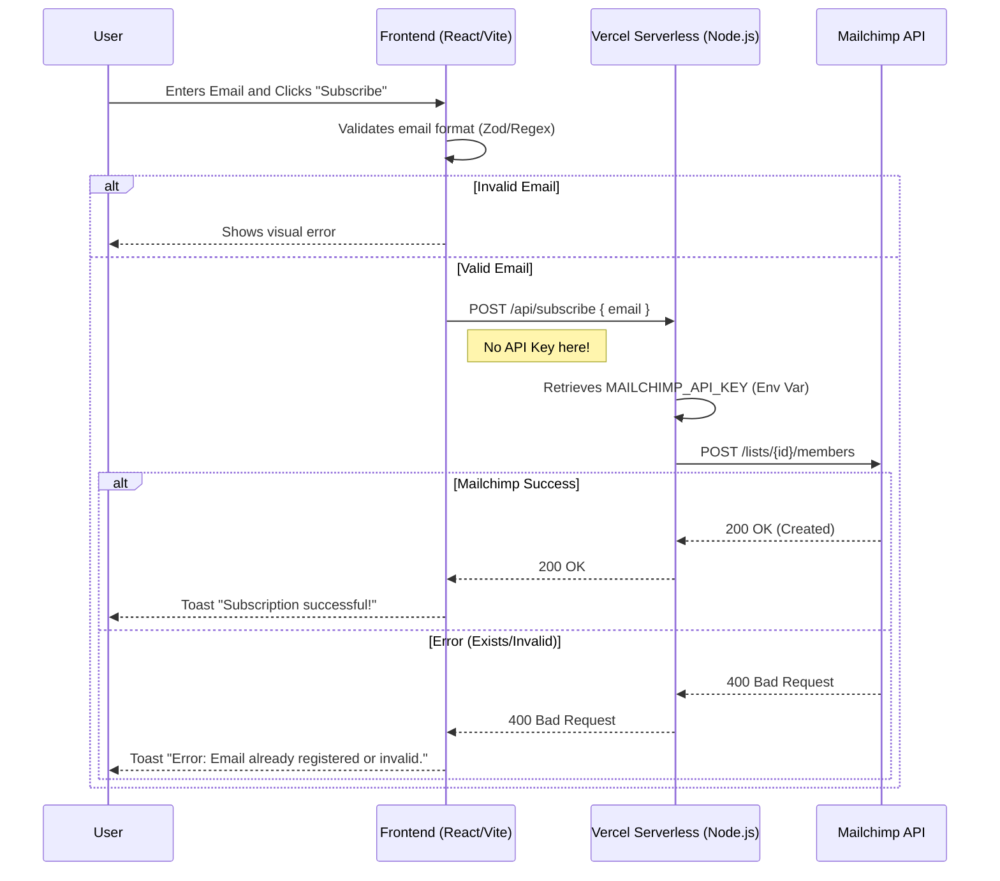

# 🚀 Newsletter Portfolio (Serverless Integration)

This project is a Full-Stack implementation of a lead capture system, demonstrating secure architecture and modern web development practices.

🔗 **Demo:** [Vercel](https://newsletter-project-ten.vercel.app/)

## 🛠️ Tech Stack & Architecture

* **Frontend:** React 19, TypeScript, Vite, Tailwind CSS v4.
* **Backend:** Node.js (Vercel Serverless Functions).
* **Integration:** Mailchimp Marketing API.
* **Validation:** Zod (Schema Validation) on Front and Back.
* **DevOps:** CI/CD via Vercel, Docker (Environment Consistency).

## 🔄 Application Flow (Sequence Diagram)

The diagram below illustrates the **BFF (Backend for Frontend)** pattern used to protect API credentials:



## Architectural Decisions

### API Key Security (BFF Pattern)

Instead of calling the Mailchimp API directly from the Frontend (which would expose credentials in the client's browser), I chose to use Serverless Functions as a secure middleware.

- Flow: Client -> Next.js API (Validation + Auth) -> Mailchimp.

- This ensures the MAILCHIMP_API_KEY never leaves the secure server environment.

### Double Validation (Zod)

Data integrity is guaranteed in two layers:

- Client-side: Instant visual feedback for the user.

- Server-side: Protection against malicious requests (frontend bypass).

### Tailwind CSS v4

Adoption of the latest version (v4) for optimized performance via Lightning CSS and reduced build time.

## How to Run Locally

- Node.js 20+
- Mailchimp Account (API Key and Audience ID)

### Installation

```bash
# 1. Clone the repository
git clone https://github.com/your-username/newsletter-portfolio.git

# 2. Install dependencies
npm install

# 3. Configure Environment Variables (.env)
cp .env.example .env
# Fill in: MAILCHIMP_API_KEY, MAILCHIMP_LIST_ID, MAILCHIMP_DATACENTER

# 4. Run the development server
npm run dev

```